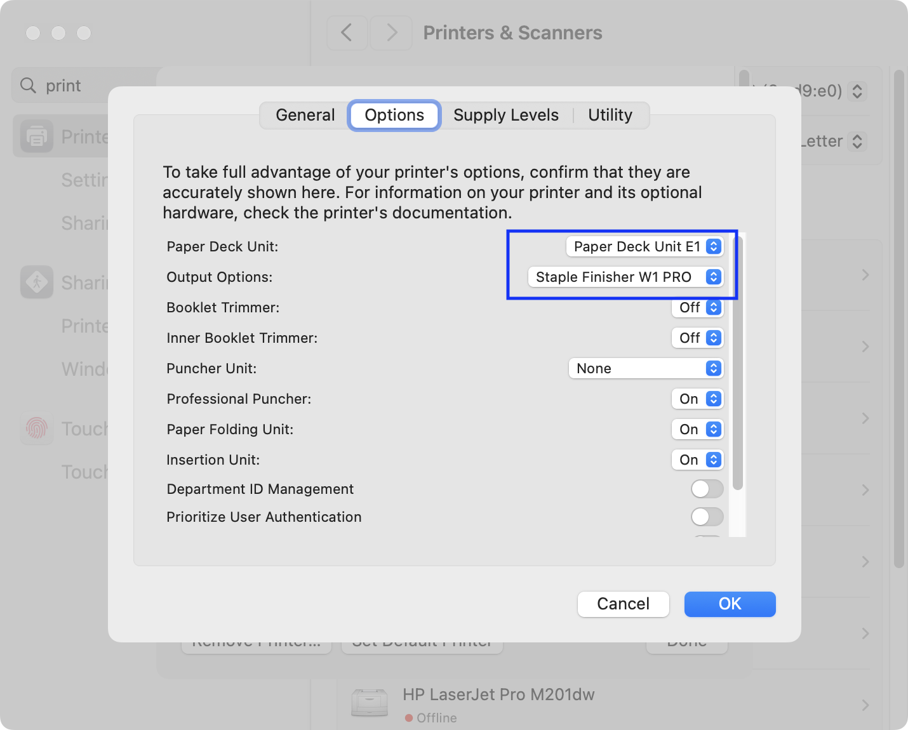
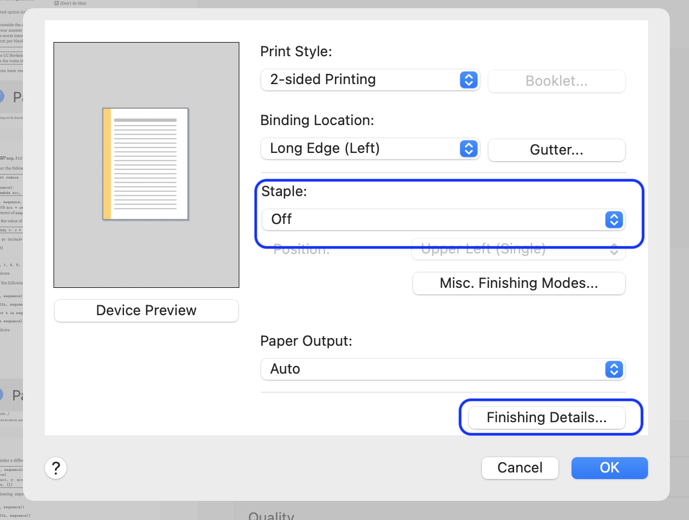

# Printing to Soda Copiers via USB

The copiers in Soda are Canon iR-ADV 8786i. They support USB printing, but you need to install the drivers on your computer first. The drivers are available on Canon's website, and you can download the UFRII_v10.19.21_mac.zip file for macOS.

## Get Drivers from Canon

https://www.usa.canon.com/support/p/imagerunner-advance-dx-8786i?srsltid=AfmBOoqs8k-hEBSw8mmbcC18N7j8l8HqhC0QRlNzt_2ASrGxvh4qxenM

Look for the file: UFRII_v10.19.21_mac.zip

## Adding the printer
* Install the drivers by running the installer package in the zip file
* Open System Preferences > Printers & Scanners
* Click the + button to add a new printer
* Select the Canon iR-ADV 8786/8795 UFR II printer from the list of available printers
* Set a custom name for the printer, such as "Canon_iR_ADV_8786_8795_UFR_II_Front"
* Click Add to add the printer to your system

**Tell macOS there's a stapler**
* Open the Printers & Scanners settings
* Select the Canon iR-ADV 8786/8795 UFR II printer from
* Click on "Options & Supplies"
* Go to the "Options" tab
* Find the row for "Paper Deck Unit" and select "Paper Deck Unit E1"
* Find the row for "Output Options" and select "Staple Finisher W1 Pro"

Click OK to save the settings.



## Printing with the Print UI
* Open the file you want to print
* Press Command + P to open the print dialog
* Select the Canon iR-ADV 8786/8795 UFR II printer from the list of available printers
* Click on the "Show Details" button to access the printer options
* Set the number of copies you want to print
* Ensure double-sided printing is enabled
* Click on "Printer Options" to access additional settings
  * Click on the "Finishing" (the "i" icon on the right) tab and enable "Staple" if you want to staple the copies together
  * Click on "Finishing Details…" to enable Copy Set Numbering if you want to add copy numbers on the bottom corner of each page.

#### Images





## Check stapling options

```sh
lpoptions -p Canon_iR_ADV_8786_8795_UFR_II -l | grep Staple
```

  CNStaple/Staple: False *True Stapleless
  StapleLocation/Position: *TopLeft BottomLeft Left TopRight BottomRight Right Top Bottom
  Paper Source = Cas2

# Set default to staple

```sh
lpoptions -p Canon_iR_ADV_8786_8795_UFR_II -o CNStaple=True
```

# Print One file

```sh
lpr -P Canon_iR_ADV_8786_8795_UFR_II -o Staple=True "Final_Exam_A__printouts_253_to_288_Part2.pdf"
```

## Printing multiple copies of a file

```
lpr -P Canon_iR_ADV_8786_8795_UFR_II -o Staple=True -o NumCopies=3 "Final_Exam_A__printouts_253_to_288_Part2.pdf"
```

### Adding Copyset Numbering to the Output

**TODO**
```sh
lpr -P Canon_iR_ADV_8786_8795_UFR_II .... "file.pdf"
```

## Schedule a batch
on macOS this immediately sends the file to queue, which you can view by opening the printer app.

```sh
PRINTER='Canon_iR_ADV_8786_8795_UFR_II_Front'
for pdffile in $(ls *.pdf | sort -V); do
  lpr -P $PRINTER -o InputSlot=Cas2 -o CNStaple=True "$pdffile";
  mv $pdffile printed/;
  echo $pdffile;
done
```
